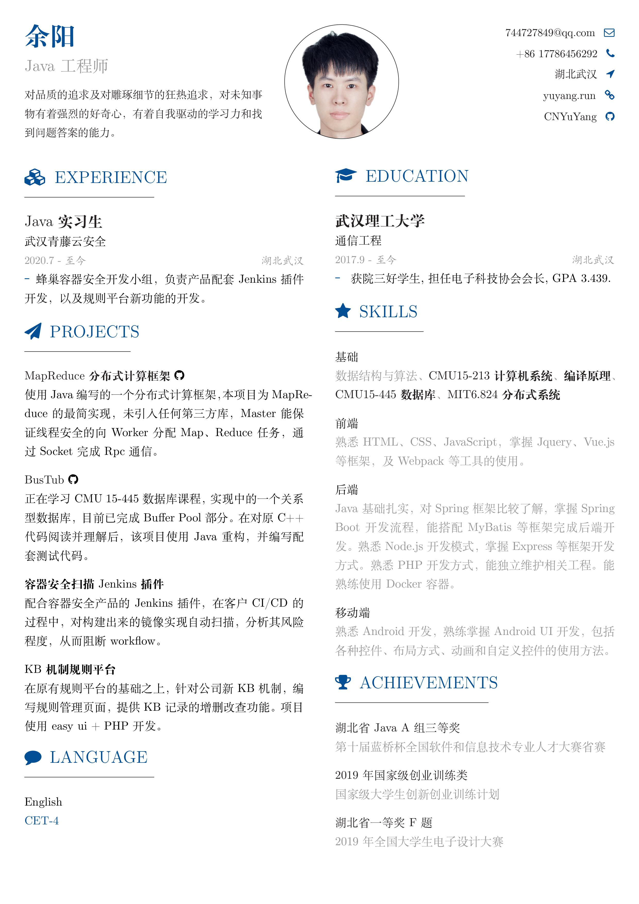

# YuYang的简历

## 编译

```bash
xelatex -synctex=1 -interaction=nonstopmode YuYang.tex
```

## 效果展示



## 实习经历模板

```tex
% Experience Template
\item[] {\RoleFont Experience Role} \\
\normalfont Company \\ 
{\DateFont StartDate - EndDate \hfill Location } \\ 
{\color{CV_Color}\LARGE - }{Description}
```
## 项目经历模版

```tex
% Project Template
\item[] \href{https://github.com/}{\textbf{Project Name}} \verb||\faGithub\enskip \\ 
Description of project.
```

## 外语水平模板

```tex
% Language Template
\item[] {Language} \\
{\color{CV_Color} Proficiency Level}
```

## 教育经历模板

```tex
% Education Template
\item[] {\RoleFont Degree Name} \\
\normalfont School Name \\
{\DateFont StartDate- EndDate \hfill Location }\\
{\color{CV_Color}\LARGE - } Description, GPA, etc.
```

## 专业技能模板

```tex
\item[] {\normalfont {移动端}} \\
{\AchFont 熟悉Android开发，熟练掌握 Android UI 开发，包括各种控件、布局方式、动画和自定义控件的使用方法。}
```

## 获奖经历模板

```tex
% Achievement Template
\item[] \href{https://www.google.com/}{\normalfont {蓝桥杯国家二等奖}} \\
{\AchFont 第十一届大学JAVA A组}
```